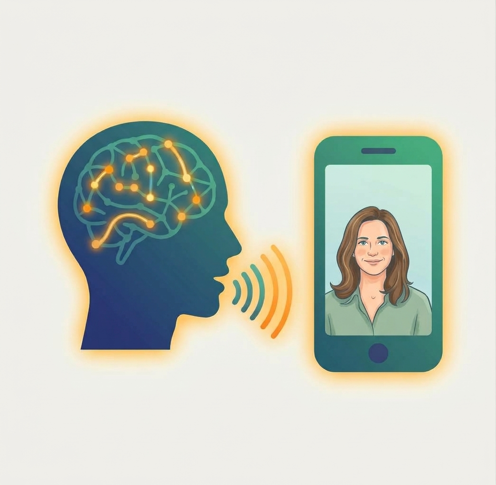
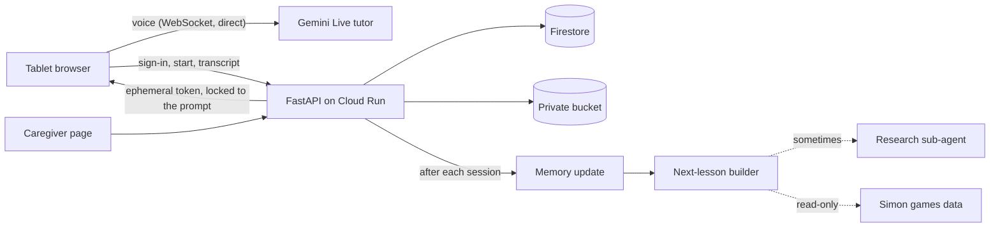

# דברו איתי (Dabru Iti): a Hebrew speaking tutor after a stroke



A private web app where a Hebrew speaker recovering from a stroke practices **speaking out loud** with a warm, patient voice tutor. The tutor runs on the Gemini Live native-audio model. Between sessions, the app remembers what he talked about, tracks the words and names he practices, reads his progress in a companion [games app](https://github.com/TomerShimshi/simon), and prepares the next lesson. The family follows it all on a caregiver page.

> This app supplements speech therapy with a human therapist. It does not replace it.

<br clear="left">

## How it works



1. **A session.**
   - The backend builds the tutor's instructions (her role and rules, his profile, what she remembers, today's lesson plan, what he played lately). It mints a one-time token **locked to those instructions**.
   - The browser talks to Gemini Live **directly**: audio never passes through our server, and the API key never reaches the browser.
   - The transcript is saved as the conversation goes, **in code, not by a model**.
2. **After the session, three model calls:**
   - **Memory update:** a tool-calling agent reads the transcript. It updates the long-term memory (people, places, interests, what works), scores the practised words with spaced repetition, and raises flags for the family. That includes **tutor mistakes**, such as asking about a person who isn't part of his life.
   - **Next-lesson builder:** writes the next session's plan. It has one main goal and 3–5 uncued check-in items (the progress measure: practised vs. new items), hints, an activity, homework and a game to play.
     - **Code guards** reject plans that invent his people, use answers that are too easy, or repeat the check-in items in practice.
     - It may ask the research sub-agent once (below).
   - **Research sub-agent** (only when needed): looks up evidence-based home-practice techniques with **Tavily**, on trusted sites first (ASHA, PubMed, NIH, aphasia guidelines). Only techniques whose source the search actually returned are kept, and anything medical is dropped.
3. **The caregiver page** (`/caregiver`, caregivers only), for every account:
   - **Reading:** sessions with summaries, check-in results, full transcripts and **the exact prompt the tutor got**; the next lesson and the prompt for the next session; the memory and its history; the word bank; research notes; games-app suggestions.
   - **Actions:** rebuild the next lesson now; notes for the planner; remove a wrong memory item or word; restore an earlier memory version; mark flags handled; open a prefilled GitHub issue for the games app; reset.
   - **Export:** a printable summary for his speech therapist.

## Repository layout

| Path | What's there |
|---|---|
| `app/main.py` | FastAPI: sign-in check, session start (token) / transcript / end, the hourly sweep. |
| `app/caregiver_api.py` | The caregiver page's API (`/api/caregiver/*`). |
| `app/session_prompt.py`, `app/prompts.py`, `app/live_token.py` | Building the tutor's instructions and the locked Live token. |
| `app/agent/` | The agent loop (`runner.py`), memory update, next-lesson builder, research sub-agent, memory edits. |
| `app/store.py` | Firestore storage (plus an in-memory version for tests). |
| `app/games.py` | Read-only access to the games app's progress (Upstash). |
| `prompts/*.yaml` | Every prompt, versioned (`prompt_version` is saved with each session and plan). |
| `static/` | The tutor app and the caregiver page (plain HTML/JS, RTL Hebrew). |
| `deploy/` | GCP setup, deploy, and the budget kill switch. |
| `docs/plans/` | The [master design](docs/plans/00-master-design.md) and one plan per step, each with "notes from building it". |

## Run locally

```
python -m venv .venv
.venv\Scripts\activate          # Windows  (source .venv/bin/activate on macOS/Linux)
pip install -r requirements-dev.txt
copy .env.example .env          # then fill it in (below)
uvicorn app.main:app --reload
```

Open http://localhost:8000 (health check: `/api/health`).

`.env` (never committed; the repo is public):

| Setting | What |
|---|---|
| `GEMINI_API_KEY` | From [Google AI Studio](https://aistudio.google.com/apikey). |
| `ALLOWED_EMAILS`, `CAREGIVER_EMAILS` | Comma-separated Google accounts allowed to use the app / the caregiver page. |
| `FIREBASE_API_KEY`, `FIREBASE_AUTH_DOMAIN`, `FIREBASE_APP_ID` | The Firebase web config (Google sign-in). |
| `UPSTASH_REDIS_REST_URL`, `UPSTASH_REDIS_READONLY_TOKEN`, `SIMON_APP_URL`, `SIMON_PROFILES` | Optional: the games app, **read-only** token; `account=profile` pairs. |
| `TAVILY_API_KEY` | Optional: research (free 1,000 searches/month); without it research is skipped. |

The private patient profile is a gitignored local file for development (`prompts/patient_profile.local.md`). In production it's in the private bucket.

## Test

```
pytest
```

The tests use fakes for Gemini, Firestore, Upstash and Tavily, so they never call a real service.

## Deploy to GCP

1. Create a GCP project, link a billing account, and create the Gemini key **for that project**.
2. Set up Firebase Authentication with the Google provider for the same project (see [sub-plan 03](docs/plans/03-auth-db-transcripts.md)).
3. Install the [Google Cloud CLI](https://cloud.google.com/sdk/docs/install) and run `gcloud auth login`.
4. From Git Bash (or any bash):
   ```
   PROJECT_ID=<your-project> ./deploy/setup_gcp.sh   # one time (safe to re-run)
   ./deploy/deploy.sh                                # every deploy
   ```

`setup_gcp.sh` does the following:
- enables the APIs
- puts the keys from `.env` into **Secret Manager**
- creates Firestore (all client access denied: only the backend reads and writes)
- creates a private bucket, which holds the patient profile, plus prompt archives and memory backups (those two expire after 30 days)
- creates the hourly **memory sweep** (Cloud Scheduler)
- creates the **budget and kill switch**

`deploy.sh` deploys to Cloud Run (0–1 instances) and keeps only what's live: old revisions, images and source archives are cleaned up.

### Budget kill switch
A budget publishes to a Pub/Sub topic. The `budget-killswitch` function ([deploy/budget_killswitch/](deploy/budget_killswitch/main.py)) **disables billing on the project** once the reported cost reaches the budget, which stops every paid service. Budget data lags by a few hours. To bring the app back, check the cost, then re-link billing (Billing → Account management). Dry run:

```
KILLSWITCH_DRY_RUN=true PROJECT_ID=<your-project> ./deploy/setup_gcp.sh
gcloud pubsub topics publish budget-alerts --message='{"costAmount": 2, "budgetAmount": 1}'
gcloud functions logs read budget-killswitch --region us-central1 --limit 5
```

## Cost and privacy
- **GCP:** within the free tier (Cloud Run, Firestore, Storage, Secret Manager, Scheduler).
- **Gemini, free tier (current):** free, but Google may use the content to improve its products, and the stronger models' daily quota runs out (the app then falls back to smaller models).
- **Gemini, paid tier (planned, [sub-plan 10](docs/plans/10-paid-gemini.md)):** about **$0.25–0.50 per ~12-minute session**, roughly $8–15 a month for a daily session. The content isn't used to improve Google's products. The budget and kill switch must be raised **before** switching.
- **Research:** Tavily's free tier; only generic clinical keywords are ever sent (queries containing his names, places or Hebrew are blocked in code).

## Safety
- An emergency button on every screen shows the stroke warning signs (BE-FAST) and Magen David Adom (101).
- No medical, medication or prognosis advice, by design (prompts, plus a code filter on research).
- Sign-in is limited to an allowlist; the caregiver page only to caregivers. Secrets live in Secret Manager.

---
Made by Tomer Shimshi.
